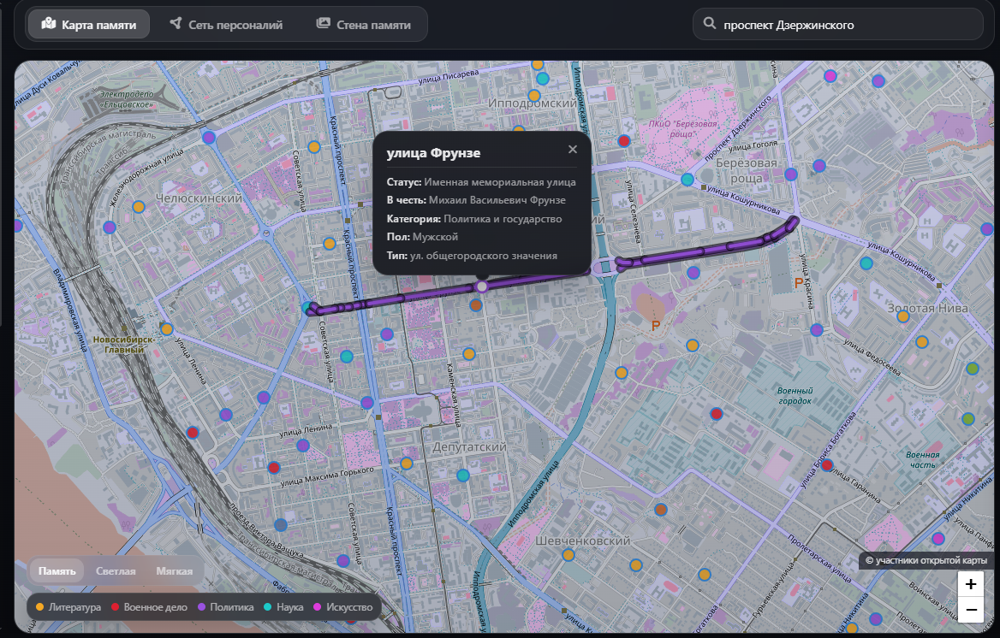
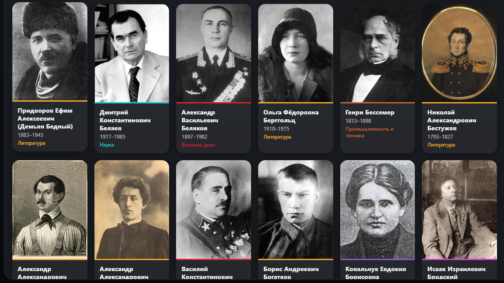
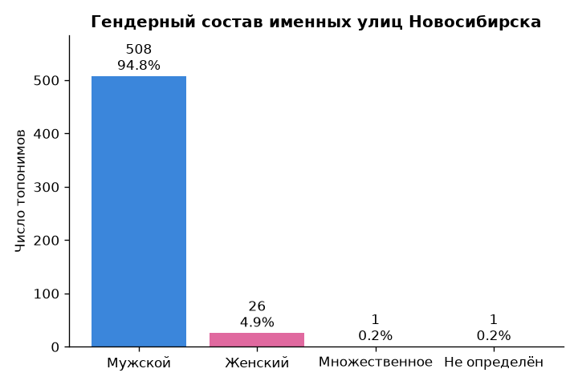
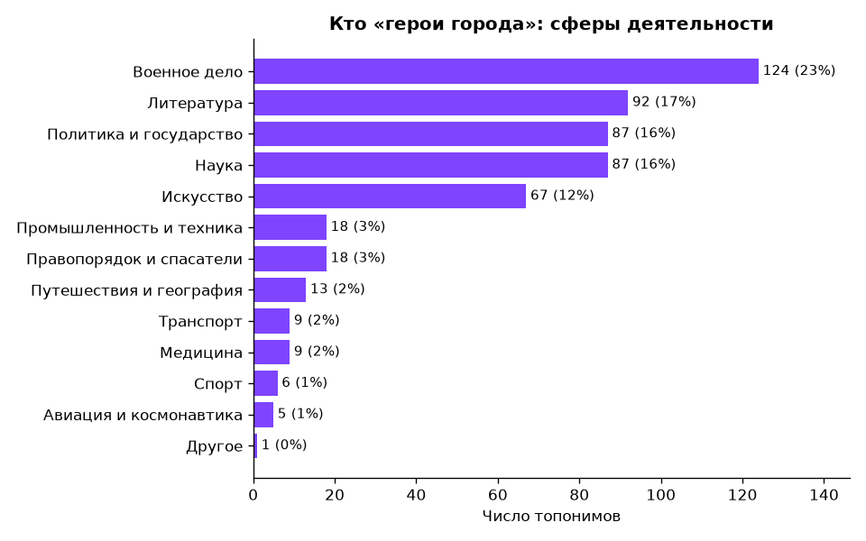
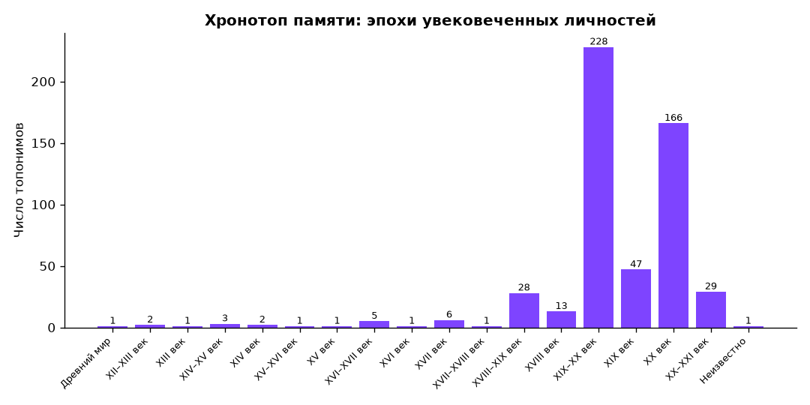
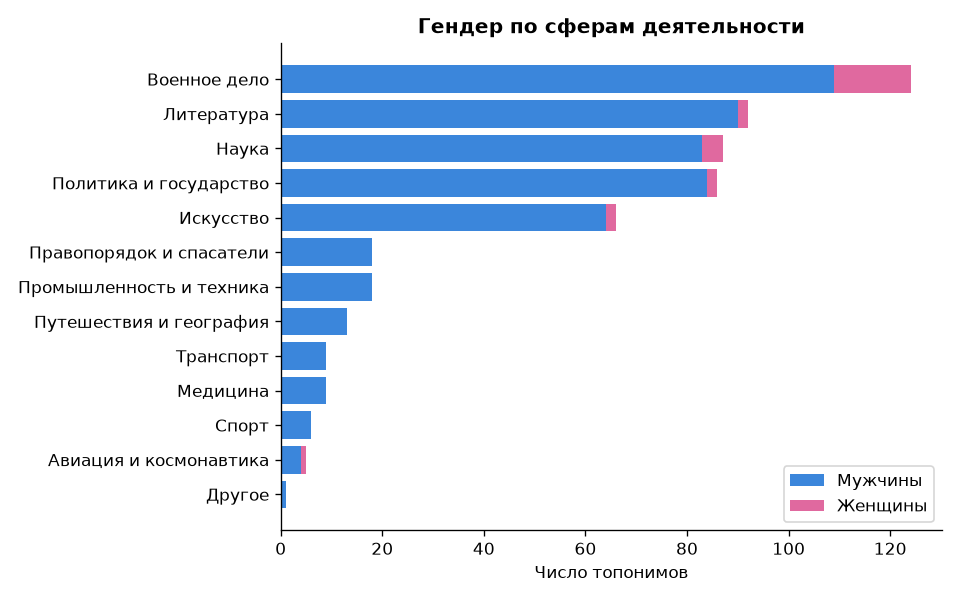
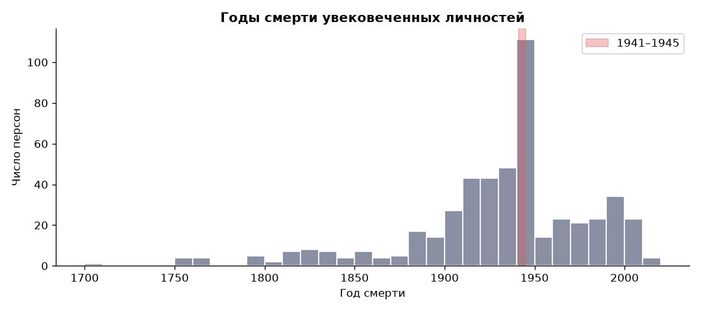
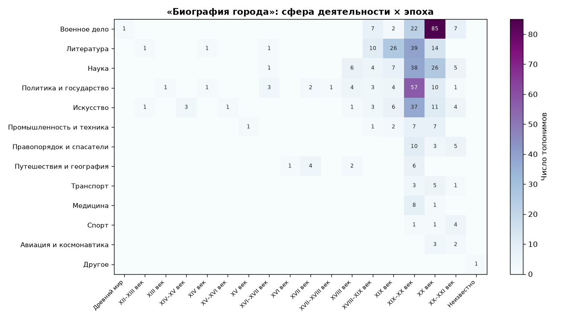

# 🏙️ Город как текст
### Топонимическая память Новосибирска: цифровой анализ названий улиц

> **«Кого увековечивает топонимика города?»** – исследование 2 783 улиц Новосибирска методами цифровой гуманитаристики (Digital Humanities). Названия улиц рассматриваются как прочитываемая запись коллективной памяти, в которой проявляются гендерные, профессиональные и исторические перекосы.

**Авторы:** Оствальд Артём · Борисов Артём – студенты НИУ ВШЭ, факультет гуманитарных наук (ФГН), 2 курс
**Дисциплина:** Digital Humanities · итоговый проект · 2026

  

---

## 🧭 О проекте

В гуманитарной географии и семиотике город рассматривается как **многослойный текст**. Названия улиц – не просто навигационные указатели, а идеологические маркеры и инструмент формирования локальной идентичности. Этот проект «читает» текст Новосибирска количественно: кто, из какой сферы и какой эпохи попадает в уличный пантеон, а кто из него выпадает.

Исследование сочетает **исследовательский текст** (`RESEARCH.md`), **воспроизводимый код** (два Jupyter-ноутбука) и **интерактивный дашборд** с картой, графиками и сетевым графом.

## ❓ Исследовательский вопрос

> **Кого увековечивает топонимика города?**

Вопрос раскрывается по четырём осям:

| Ось | Что выясняем |
|---|---|
| 🚻 **Гендер** | Мужчины или женщины? |
| 🎖️ **Сфера** | Военные, наука, культура, политика? |
| 🕰️ **Эпоха** | Какие исторические периоды доминируют? |
| 🔗 **Связи** | Кто увековечен повторно, как связаны улицы и личности? |

## 🔑 Главные результаты

| Показатель | Значение |
|---|---|
| Всего топонимов | **2 783** |
| Именных улиц (в честь человека) | **536** (19%) |
| Уникальных личностей | **433** |
| Покрытие Wikipedia / Wikidata | **92% / 91%** |
| Гендерный баланс | **95% мужчин / 5% женщин** (508 / 26) |
| Топ-4 сферы (военное дело, литература, наука, политика) | **73%** всех имён |
| Военных, погибших в 1941–1945 | **62 из 124** |
| Доля деятелей XIX–XX веков | **87%** |

**Вывод:** городская память Новосибирска системно **мужская, милитаризованная и сжатая в XIX–XX веках**, со структурным центром вокруг Великой Отечественной войны.

---

## ✨ Интерфейс дашборда

Интерактивное веб-приложение (`dashboard/`) позволяет исследовать данные вживую:

- 🗺️ **Карта 536 именных улиц** на Leaflet – маркеры с цветовым кодированием по сфере/полу; при клике подгружается и подсвечивается реальная геометрия улицы из OpenStreetMap.
- 🎛️ **Фильтры** по полу, сфере деятельности и эпохе – карта, графики и граф обновляются синхронно.
- 📊 **Живые графики** (Chart.js): гендер, сферы, эпохи, годы смерти.
- 🕸️ **Сетевой граф** «улица ↔ личность» (Vis.js) – наглядно показывает повторно увековеченных людей.
- 🔎 **Умный поиск** по улицам и персоналиям с морфологической нормализацией.
- 🖼️ **Карточки персон** с портретами (локальный архив + онлайн-источники) и DH-комментариями.
- 🌗 **Тёмная/светлая темы** и «стеклянные» панели.

**«Карта памяти» – интерактивная карта именных улиц с подсветкой геометрии и карточкой улицы:**



**«Стена памяти» – галерея всех увековеченных персон с портретами:**



**Карточка персоны – портрет, биография и DH-комментарий о типе памяти:**


## 🖼️ Галерея результатов

Все графики воспроизводимо генерируются скриптом `analysis/build_figures.py`.

<table>
  <tr>
    <td width="50%"><br><sub><b>Гендер:</b> 95% улиц названы в честь мужчин.</sub></td>
    <td width="50%"><br><sub><b>Сферы:</b> топ-4 дают почти три четверти имён.</sub></td>
  </tr>
  <tr>
    <td width="50%"><br><sub><b>Хронотоп:</b> 87% – деятели XIX–XX веков.</sub></td>
    <td width="50%"><br><sub><b>Гендер × сфера:</b> женщины присутствуют лишь в 6 из 13 сфер.</sub></td>
  </tr>
  <tr>
    <td width="50%"><br><sub><b>Годы смерти:</b> заметный пик 1941–1945.</sub></td>
    <td width="50%"><br><sub><b>Сфера × эпоха:</b> «горячий» узел – военные XIX–XX вв.</sub></td>
  </tr>
</table>

---

## 🚀 Локальный запуск

Дашборд – статическое веб-приложение, ему нужен лишь простой локальный сервер (из-за ограничений браузера на `fetch()` по `file://`).

**1. Клонируйте репозиторий**
```bash
git clone <URL-репозитория>
cd city-memory-project
```

**2. Запустите локальный сервер из корня проекта**
```bash
python -m http.server 8080
```
> Windows PowerShell: `py -m http.server 8080`

**3. Откройте в браузере**
```
http://localhost:8080/dashboard/
```

**4. Исследуйте.** Кликайте по маркерам, ищите улицы и персон, переключайте фильтры по полу / сфере / эпохе, открывайте сетевой граф.

> ⚠️ **Нужен локальный сервер.** Прямое открытие `dashboard/index.html` через `file://` не загрузит JSON-данные.
>
> ⚠️ **Нужен интернет.** Тайлы карты (OSM), библиотеки (Leaflet, Chart.js, Vis.js) и часть портретов подгружаются онлайн. Без сети работают 48 локальных фото из `dashboard/photos/`, для остальных персон показываются инициалы.

### Воспроизведение анализа

```bash
pip install -r requirements.txt
# сбор и обогащение данных:
jupyter notebook data_collector.ipynb
# анализ и графики:
jupyter notebook analysis/analysis.ipynb
# либо одной командой перестроить все графики:
python analysis/build_figures.py
```

---

## 🗂️ Структура репозитория

```
city-memory-project/
├── README.md               – этот файл
├── RESEARCH.md             – исследовательский текст (6 разделов)
├── ANALYTICAL_SUMMARY.md   – краткая аналитическая сводка
├── ATTRIBUTION.md          – источники и лицензии данных
├── INSTRUCTION.md          – подробная инструкция по запуску
├── LICENSE                 – лицензия MIT (на исходный код)
├── requirements.txt        – Python-зависимости
├── .gitignore
├── data_collector.ipynb    – ноутбук №1: сбор данных (OSM + Wikidata)
├── analysis/
│   ├── analysis.ipynb          – ноутбук №2: анализ и визуализации
│   ├── build_figures.py        – воспроизводимая генерация графиков
│   └── figures/                – готовые графики (PNG)
├── data/
│   ├── city_registry.json          – реестр городов (центр карты, bbox)
│   ├── novosibirsk_streets.json    – итоговый датасет (читает дашборд)
│   └── raw/                        – промежуточные данные пайплайна
└── dashboard/
    ├── index.html          – разметка
    ├── style.css           – стили (тёмная/светлая темы)
    ├── app.js              – карта, графики, граф, поиск, фильтры
    ├── assets/             – герб города и ресурсы
    └── photos/             – локальный архив портретов + manifest.json
```

## 🧪 Данные и воспроизводимость

- **Источники:** [OpenStreetMap](https://www.openstreetmap.org/) (улицы, геометрия) и [Wikidata](https://www.wikidata.org/) / Wikipedia (биографии: пол `P21`, род деятельности `P106`, годы жизни `P569`/`P570`).
- **Итоговый датасет:** `data/novosibirsk_streets.json` (2 783 записи, 536 именных, для каждой – имя в родительном падеже, пол, сфера, эпоха, координаты, ссылки).
- **Ручная верификация:** атрибуция 390 из 536 именных улиц проверена вручную.
- После обновления данных поднимите `DATA_VERSION` в `dashboard/app.js` (cache-busting).

Подробности лицензий данных и портретов – в `ATTRIBUTION.md` и `dashboard/photos/PHOTO_CREDITS.md`.

## 📄 Лицензия

Исходный код – под лицензией **MIT** (см. `LICENSE`). Данные распространяются на условиях их исходных источников (OSM – ODbL, Wikidata – CC0); см. `ATTRIBUTION.md`.

## 👥 Авторы

- **Оствальд Артём** – НИУ ВШЭ, ФГН, 2 курс
- **Борисов Артём** – НИУ ВШЭ, ФГН, 2 курс

Итоговый проект по курсу Digital Humanities, 2026.
